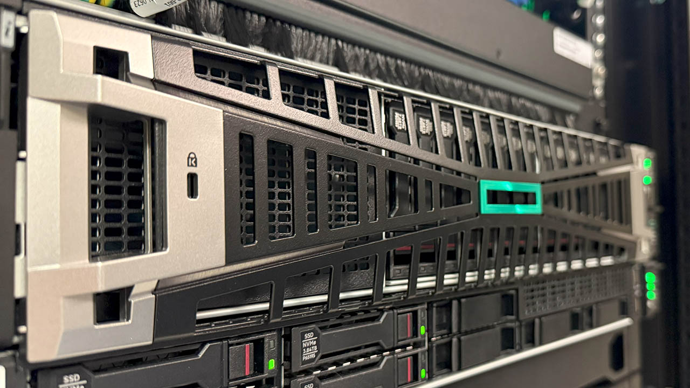
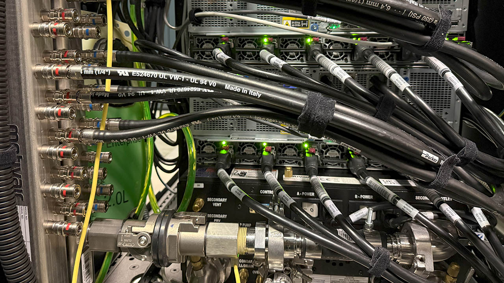
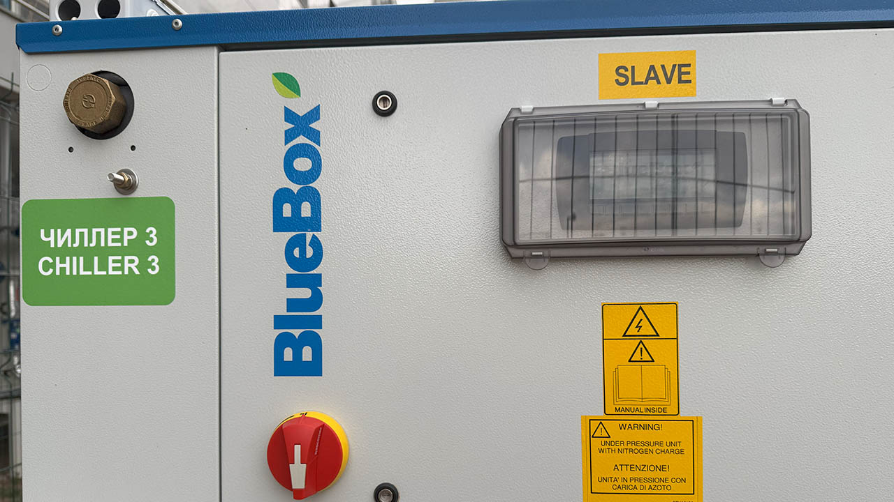
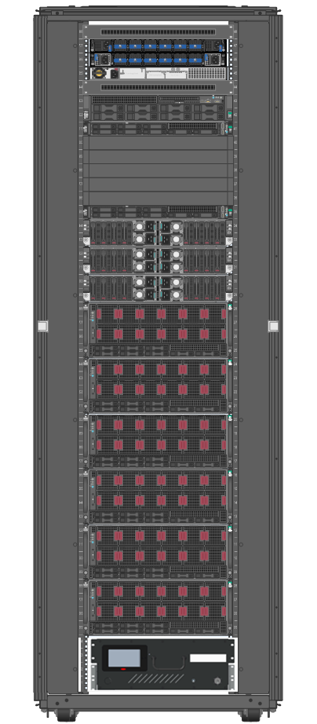
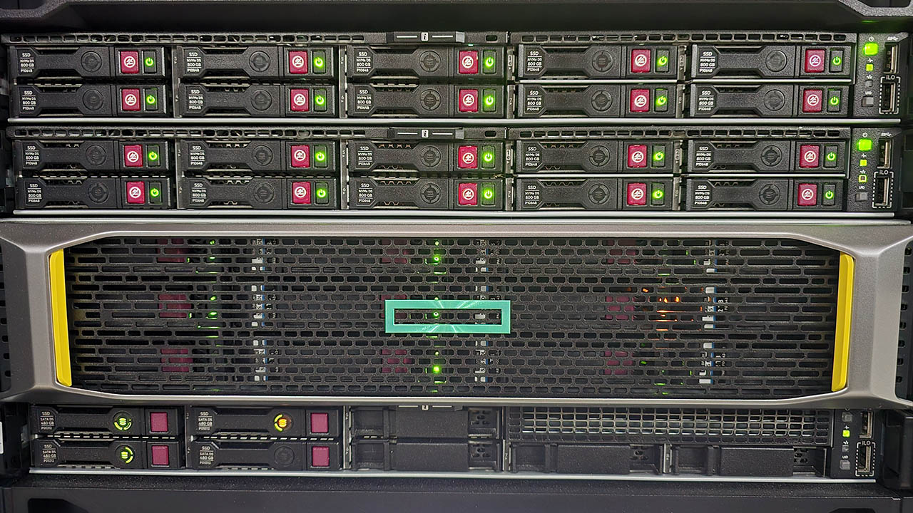
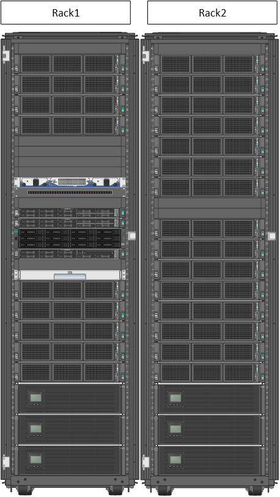
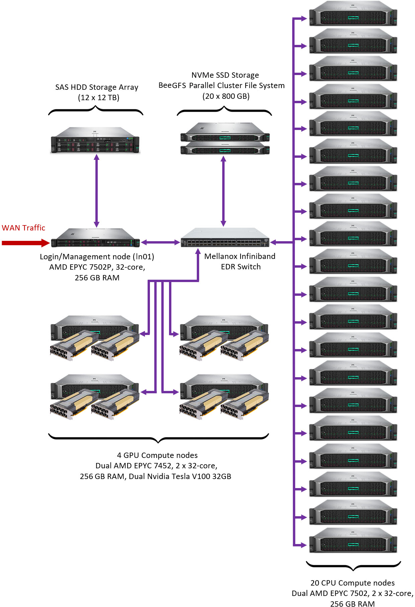
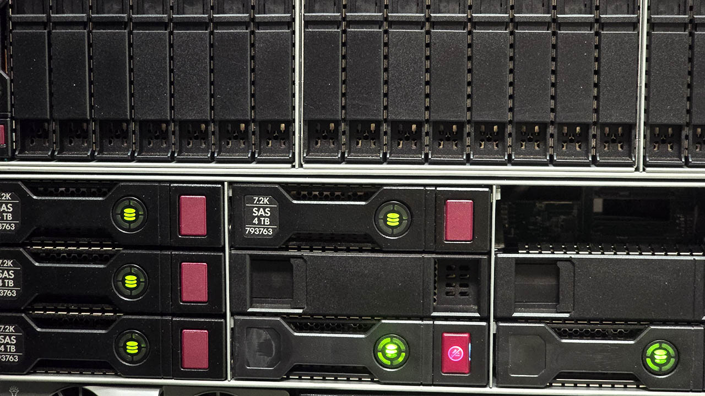
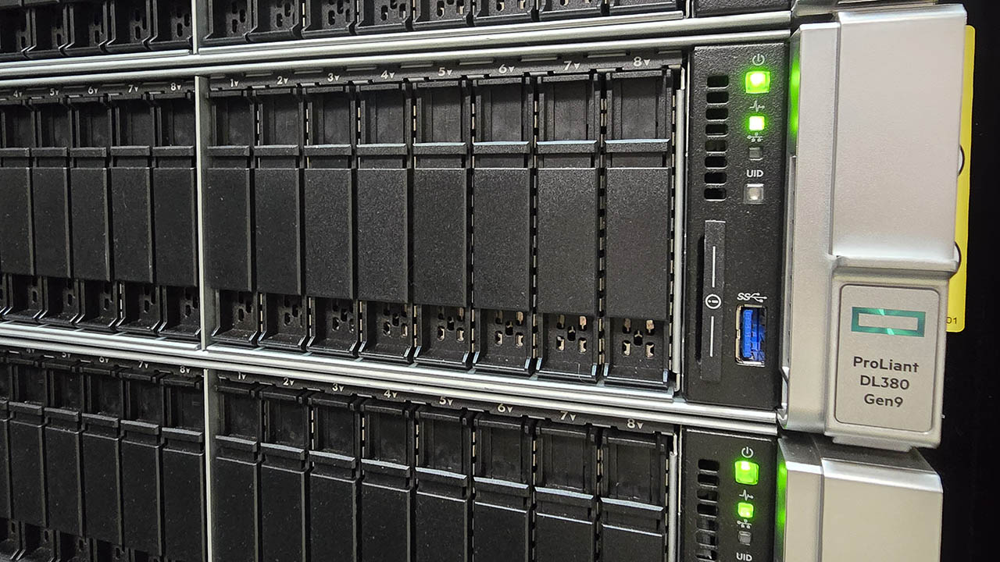

<div class="hero" markdown>

# Systems

Compare NU Research Computing clusters, understand what their specifications mean, and choose the partition that matches your workload.

[Choose a system](#choose-a-system){ .md-button .md-button--primary }
[Connect to a cluster](#access-endpoints){ .md-button }

</div>

NU Research Computing operates three HPC clusters: **Irgetas**, **Shabyt** and **Muon**. They use the same basic workflow—connect to a login node, prepare files, and submit computation through Slurm—but differ substantially in CPU generation, memory, accelerators, network fabric and storage.

<div class="quick-grid" markdown>

<a class="quick-card" href="#irgetas">
<strong>Irgetas</strong>
<span>Modern AMD EPYC CPU nodes and NVIDIA H100 GPU nodes for demanding CPU, MPI and GPU workloads.</span>
</a>

<a class="quick-card" href="#shabyt">
<strong>Shabyt</strong>
<span>General-purpose AMD EPYC cluster with CPU nodes and NVIDIA V100 GPU nodes.</span>
</a>

<a class="quick-card" href="#muon">
<strong>Muon</strong>
<span>Compact CPU-only Intel Xeon cluster. Access is provided by request.</span>
</a>

</div>

!!! info "What has been verified"
    During the August 2026 documentation migration, administrators confirmed the SSH endpoints, internal addresses, login-node names, operating system family, Slurm partition names, Muon access route and the AMD EPYC 9684X processors in Irgetas GPU nodes. The detailed hardware inventory is based on the source page saved on 4 August 2026. Node availability, reservations and scheduler settings can still change; treat live Slurm output as authoritative.

!!! danger "Login nodes are not compute nodes"
    `access`, `lgn01` and `mln01` are shared entry points. Use them for file management, editing, compilation, data transfer and job submission. Run production computation on nodes allocated by Slurm, never directly on a login node.

## Choose a system

Your research group and account permissions determine which systems you may use. Within those permissions, choose the smallest partition that provides the CPU architecture, memory, GPUs and interconnect required by the application.

### At a glance

| Cluster | Compute nodes | CPU cores per node | RAM per node | GPU resources | Slurm partitions | Access |
|---|---:|---:|---:|---|---|---|
| **Irgetas** | 10 CPU + 6 GPU | 192 | 384 GB CPU; 768 GB GPU | 4 × NVIDIA H100 80 GB per GPU node | `ZEN4`, `H100` | Assigned NU groups |
| **Shabyt** | 20 CPU + 4 GPU | 64 | 256 GB | 2 × NVIDIA V100 32 GB per GPU node | `CPU`, `NVIDIA` | Assigned NU groups |
| **Muon** | 10 CPU | 14 | 64 GB | None | `HPE` | By request |

All three clusters currently run **Rocky Linux 9.7**. Application environments still differ because installed modules, drivers, compilers and libraries are managed per cluster; check [Software](software.md) and run `module spider <name>` on the target system.

The core counts above describe physical CPU cores. Each processor also supports simultaneous multithreading, so operating-system or Slurm output may show more hardware threads than physical cores. See [Cores, threads and Slurm CPUs](#cores-threads-and-slurm-cpus) before copying these numbers into `--cpus-per-task`.

### Start with the workload

| Workload | Recommended starting point | Why | Verify before a large run |
|---|---|---|---|
| Serial or small CPU program | CPU partition on an authorized cluster | Does not reserve scarce accelerators | Runtime, peak RAM and whether the application actually uses multiple cores |
| Shared-memory OpenMP or threaded application | `ZEN4`, `CPU` or `HPE` | Threads remain within one node and share its RAM | Tested thread count, NUMA behavior and memory bandwidth |
| Multi-node MPI application | Irgetas `ZEN4` or Shabyt `CPU`; Muon `HPE` when authorized | Compute nodes are connected by InfiniBand | MPI build, process placement, scaling efficiency and input/output pattern |
| CUDA, GPU-enabled AI or GPU-enabled simulation | Irgetas `H100` or Shabyt `NVIDIA` | These are the GPU partitions | Supported GPU generation, CUDA stack, GPU-memory requirement and requested GPU count |
| Many independent cases | CPU partition plus a Slurm job array | Each case can be scheduled separately | Array concurrency, per-task runtime and output-file naming |
| CPU-only job requiring more than the listed CPU-node RAM | Contact the HPC team | Reserving a GPU node only for its RAM wastes accelerators | Whether a high-memory resource or different workflow is available |

!!! tip "H100 versus V100"
    H100 is a newer accelerator with more memory per GPU, but “newer” does not automatically mean “compatible.” Confirm that the application, container, CUDA runtime and libraries support the target GPU. An older, tested V100 workflow may be more useful than an untested H100 workflow.

!!! warning "Do not select a GPU partition for a CPU-only job"
    GPU nodes also contain powerful CPUs, but the GPUs remain unavailable to other users while the node is reserved. Use `H100` or `NVIDIA` only when the job actually uses the accelerators, unless the HPC team explicitly approves another use.

## Access endpoints

Connect from the campus network or through the approved NU VPN. Prefer the FQDN in scripts and documentation; an internal IP address may change during maintenance.

| Cluster | SSH endpoint | Internal address | Login-node hostname | CPU partition | GPU partition |
|---|---|---|---|---|---|
| **Irgetas** | `irgetas.nu.edu.kz` | `172.25.1.32` | `access` | `ZEN4` | `H100` |
| **Shabyt** | `shabyt.nu.edu.kz` | `172.23.0.12` | `lgn01` | `CPU` | `NVIDIA` |
| **Muon** | `muon.nu.edu.kz` | `172.24.1.10` | `mln01` | `HPE` | — |

=== "Irgetas"

    ```bash
    ssh <username>@irgetas.nu.edu.kz
    ```

=== "Shabyt"

    ```bash
    ssh <username>@shabyt.nu.edu.kz
    ```

=== "Muon"

    ```bash
    ssh <username>@muon.nu.edu.kz
    ```

    Muon access is enabled by request; an account on another NU cluster does not by itself guarantee access to Muon.

After login, confirm where the session landed:

```bash
hostname
hostname -f
whoami
pwd
```

The hostname should identify the appropriate login node. Follow the full account, VPN, MFA and host-key procedure in [Quick Start](quick-start.md#connect-with-ssh).

## How to read the specifications

HPC specifications are useful only when they are connected to the way an application runs.

| Term | What it means | Why it matters to a job |
|---|---|---|
| **Compute node** | A server on which Slurm runs user jobs | Resources requested from one node share that node's CPUs, RAM and optional GPUs |
| **Socket / CPU** | A physical processor package | A two-socket node contains two processors and multiple NUMA memory regions |
| **Physical core** | An independent CPU execution core | CPU-bound performance usually scales with cores only while the software has enough parallel work |
| **Hardware thread** | A logical execution context on a core | Two threads per core do not equal two full physical cores; scaling must be measured |
| **RAM** | Memory available to running programs | Exceeding the Slurm memory allocation can terminate a job; installed RAM is not always fully allocatable |
| **GPU memory** | HBM attached to one GPU | A model or data set generally must fit the memory of each GPU used, unless the application distributes it |
| **Local SSD / scratch** | Storage physically attached to one node | Fast temporary I/O, but not a substitute for durable shared storage; availability and cleanup rules must be confirmed |
| **Shared storage** | Filesystems visible from login and compute nodes | Appropriate for home directories, software, input and retained results, subject to quota and backup policy |
| **InfiniBand** | Low-latency, high-bandwidth cluster network | Important for communication-heavy MPI and access to storage connected through the fabric |
| **Slurm partition** | A scheduler grouping of nodes with similar hardware or policy | The selected partition determines the node type on which a job may run |

### Cores, threads and Slurm CPUs

For example, an Irgetas compute node contains two 96-core processors:

```text
2 sockets × 96 physical cores = 192 physical cores
192 cores × 2 hardware threads = 384 hardware threads
```

The site's Slurm configuration determines whether a Slurm CPU corresponds to a physical core or a hardware thread. Inspect the live configuration instead of inferring it from marketing specifications:

```bash
scontrol show node <node-name>
sinfo -N -o "%N %P %c %m %G"
```

For a threaded application, also record what the allocated node reports:

```bash
lscpu
echo "SLURM_CPUS_PER_TASK=${SLURM_CPUS_PER_TASK:-unset}"
```

## Irgetas

Irgetas is NU's newest Research Computing cluster. The HPE system was deployed in September 2025 and combines high-core-count AMD EPYC processors, NVIDIA H100 accelerators, NDR InfiniBand and direct liquid cooling.

<div class="quick-grid" markdown>

{ loading=lazy }
{ loading=lazy }
{ loading=lazy }

</div>

### Compute resources

| Role / partition | Count | Processors | Physical cores / hardware threads | RAM | GPUs | Local storage | Compute fabric |
|---|---:|---|---:|---:|---|---:|---|
| CPU node · `ZEN4` | 10 | 2 × AMD EPYC 9684X | 192 / 384 | 384 GB DDR5-4800 | — | 1.92 TB SSD | 200 Gb/s NDR InfiniBand |
| GPU node · `H100` | 6 | 2 × AMD EPYC 9684X | 192 / 384 | 768 GB DDR5-4800 | 4 × NVIDIA H100 SXM5, 80 GB HBM3 each | 1.92 TB SSD | 2 × 400 Gb/s NDR InfiniBand |
| Login node · `access` | 1 | 1 × AMD EPYC 9684X | 96 / 192 | 192 GB DDR5-4800 | — | 7.68 TB SSD | 200 Gb/s NDR InfiniBand |

The EPYC 9684X configuration for GPU nodes was confirmed by the administrator during this documentation update.

### Storage

Irgetas uses `/shared` for software and user home directories. The documented NVMe storage server has:

- 122 TB raw NVMe capacity;
- 84 TB usable capacity in RAID 6;
- two 400 Gb/s NDR InfiniBand adapters;
- a documented design target above 80 Gb/s sequential read and above 20 Gb/s sequential write from compute nodes.

Group storage is available under `/datahub/<group>`. Capacity, quota and backup coverage are separate concepts: consult [Policies and limits](policies.md#storage) before moving large or irreplaceable data.

!!! note "Performance figures are not guarantees"
    Storage throughput depends on file size, access pattern, concurrency, filesystem state and the allocated nodes. The numbers above describe the archived system inventory, not a per-job service guarantee. Benchmark only representative I/O and never stress a shared filesystem from a login node.

??? info "Irgetas full infrastructure inventory"
    **Management node**

    - AMD EPYC 9354, 32 physical cores / 64 hardware threads;
    - 256 GB DDR5-4800;
    - 15.36 TB local SSD;
    - 25 Gb/s SFP28 Ethernet.

    **Storage server**

    - 2 × AMD EPYC 9354;
    - 768 GB DDR5-4800;
    - 16 × 7.68 TB U.3 NVMe SSD;
    - RAID 6;
    - 2 × 400 Gb/s NDR InfiniBand;
    - 25 Gb/s SFP28 Ethernet.

    **Networks and cooling**

    - NVIDIA Quantum-2 QM9700 NDR switch: 64 × 400 Gb/s ports;
    - HPE Aruba CX 8325-48Y8C application switch: 25 Gb/s SFP28 connectivity;
    - HPE Aruba 2930F management switch;
    - HPE Cray XD direct-liquid-cooling system with an in-rack coolant distribution unit and three-chiller setup.

    The cluster is assembled in one rack in the NU data center in Block 1.

??? info "Irgetas theoretical peak performance"
    These are theoretical aggregate values from the archived inventory, not application benchmarks.

    | Subsystem | FP8 | FP16 | FP32 | FP64 |
    |---|---:|---:|---:|---:|
    | CPUs | — | — | 245.0 TFLOPS | 122.5 TFLOPS |
    | GPUs | 47,492 TFLOPS | 23,746 TFLOPS | 1,606 TFLOPS | 803 TFLOPS |

    { loading=lazy width="300" }

## Shabyt

Shabyt is an HPE cluster deployed in 2020. It provides general-purpose AMD EPYC CPU capacity, NVIDIA V100 GPU nodes and EDR InfiniBand. It remains useful for established CPU workflows and GPU applications validated on the V100 generation.

<div class="quick-grid" markdown>

{ loading=lazy }
{ loading=lazy }
{ loading=lazy }

</div>

### Compute resources

| Role / partition | Count | Processors | Physical cores / hardware threads | RAM | GPUs | Compute fabric |
|---|---:|---|---:|---:|---|---|
| CPU node · `CPU` | 20 | 2 × AMD EPYC 7502 | 64 / 128 | 256 GB DDR4-2933 | — | 100 Gb/s EDR InfiniBand |
| GPU node · `NVIDIA` | 4 | 2 × AMD EPYC 7452 | 64 / 128 | 256 GB DDR4-2933 | 2 × NVIDIA V100, 32 GB HBM2 each | 100 Gb/s EDR InfiniBand |
| Login node · `lgn01` | 1 | 1 × AMD EPYC 7502P | 32 / 64 | 256 GB DDR4-2933 | — | 100 Gb/s EDR InfiniBand |

### Storage

- `/shared` provides software and user home directories on a two-server NVMe RAID-6 system: 16 TB raw and 9.9 TB usable capacity.
- `/zdisk/<group>` provides group storage on a 144 TB raw HPE MSA 2050 SAS HDD array in RAID 6.

The NVMe system and HDD group array have different performance characteristics and policies. Use `/shared` for active work that benefits from lower latency, and follow [Policies and limits](policies.md#storage) for quota and backup expectations.

??? info "Shabyt full infrastructure inventory"
    **Each `/shared` storage server**

    - 1 × AMD EPYC 7452;
    - 128 GB DDR4-2933;
    - 10 × 800 GB SFF NVMe SSD;
    - 2 × 100 Gb/s EDR InfiniBand.

    **Networks**

    - Mellanox EDR v2 managed compute switch: 36 × 100 Gb/s ports;
    - HPE 5700 application switch;
    - Aruba 2540 management switch.

    The cluster is assembled in two racks in the NU data center in Block C2.

??? info "Shabyt theoretical peak performance and layout"
    These are theoretical aggregate values from the archived inventory, not application benchmarks.

    | Subsystem | FP16 | FP32 | FP64 |
    |---|---:|---:|---:|
    | CPUs | — | 121.7 TFLOPS | 60.8 TFLOPS |
    | GPUs | 897.6 TFLOPS | 112.2 TFLOPS | 56.1 TFLOPS |

    <div class="quick-grid" markdown>

    { loading=lazy width="340" }
    { loading=lazy width="340" }

    </div>

## Muon

Muon is a compact CPU-only HPE cluster deployed in 2017. It was originally associated with Physics Department workloads; current access is provided **by request**. Confirm access before preparing Muon-specific jobs.

<div class="quick-grid" markdown>

{ loading=lazy }
{ loading=lazy }
{ loading=lazy }

</div>

### Compute resources

| Role / partition | Count | Processor | Physical cores / hardware threads | RAM | GPUs | Compute fabric |
|---|---:|---|---:|---:|---|---|
| CPU node · `HPE` | 10 | 1 × Intel Xeon E5-2690 v4 | 14 / 28 | 64 GB DDR4-2400 | — | 56 Gb/s FDR InfiniBand |
| Login node · `mln01` | 1 | 1 × Intel Xeon E5-2640 v4 | 10 / 20 | 64 GB DDR4-2400 | — | 56 Gb/s FDR InfiniBand plus 1 Gb/s Ethernet |

Muon has no GPU partition. Its smaller memory and core count may suit established CPU workloads, software compatibility testing and modest parameter studies when access has been approved.

### Storage

- `/shared` uses a 3.072 TB raw SSD array in RAID-Z2 for software and user home directories.
- `/zdisk/<group>` uses a 7.2 TB raw HDD RAID-5 system for group data.

The old Policies page described an implausible “1 Mbit/s Ethernet” storage path that conflicts with the FDR InfiniBand hardware inventory. This page makes no Muon storage-throughput promise until the path is measured and documented by administrators.

??? info "Muon full infrastructure inventory"
    - Mellanox SX6005 unmanaged FDR compute switch: 12 × 56 Gb/s ports;
    - HPE 5800 management switch: 48 × 1 Gb/s ports;
    - physical location: NU data center in Block 1.

??? info "Muon theoretical peak performance"
    The archived inventory lists 11.6 TFLOPS FP32 and 5.8 TFLOPS FP64 aggregate theoretical CPU performance. These values are not application benchmarks.

## Storage comparison

All three clusters expose shared user storage, but the paths, capacity, performance and protection differ. Raw device capacity is not the same as usable filesystem capacity or an individual user quota.

| Cluster | Home / active storage | Documented system capacity | Group storage | Documented system capacity | Snapshot default quotas |
|---|---|---:|---|---:|---|
| **Irgetas** | `/shared/home/<username>` on NVMe storage | 122 TB raw / 84 TB usable | `/datahub/<group>` | Not stated on the Systems page | 400 GB home; 1 TB group |
| **Shabyt** | `/shared/home/<username>` on NVMe storage | 16 TB raw / 9.9 TB usable | `/zdisk/<group>` on HDD array | 144 TB raw | 100 GB home; 1 TB group |
| **Muon** | `/shared/home/<username>` on SSD storage | 3.072 TB raw | `/zdisk/<group>` on HDD storage | 7.2 TB raw | 300 GB home; 1 TB group |

!!! warning "RAID is not backup"
    RAID protects against some device failures; it does not protect against accidental deletion, corrupted output, software errors or every hardware incident. Keep an independent copy of irreplaceable data. The archived policy states that group storage under `/datahub` and `/zdisk` is not backed up; check the current [backup and recovery policy](policies.md#backup-and-recovery).

### Choose a data location intentionally

| Data | Recommended approach |
|---|---|
| Source code and small configuration files | Keep a version-controlled copy outside the cluster and a working copy in the project directory |
| Active input and ordinary job output | Use the documented project/home path while respecting quota |
| Large shared group data | Use the approved `/datahub/<group>` or `/zdisk/<group>` allocation |
| Temporary node-local data | Use node-local scratch only if its path, capacity and cleanup behavior are documented for that cluster |
| Irreplaceable research data | Maintain an independent approved backup outside the HPC filesystem |

## Inspect the live system

Hardware pages describe capability; Slurm describes what is available now. Run these commands on the login node.

### Partitions and nodes

```bash
# Compact partition summary
sinfo -o "%P %a %l %D %c %m %G"

# Nodes and their current state
sinfo -N -o "%N %P %t %c %m %G"

# Full settings for one partition
scontrol show partition <partition>

# Full settings for one node
scontrol show node <node-name>
```

Common state codes include `idle`, `alloc`/`allocated`, `mix`, `down` and `drain`. A partition may exist but have no currently idle node.

### Your access and queue

```bash
# Your queued and running jobs
squeue --me

# Associations and permitted QoS values, where access is allowed
sacctmgr show assoc user="$USER" format=Cluster,Account,User,Partition,QOS
```

Do not add a QoS to a batch script merely because it appears in a table. Use the account, partition and QoS assigned by the HPC team.

### Inspect an allocated compute node

Run hardware inspection only inside a Slurm allocation or batch job:

```bash
hostname
lscpu
free -h
numactl --hardware       # if installed
nvidia-smi -L            # GPU allocation only
nvidia-smi               # GPU allocation only
cat /etc/os-release
```

Record the following with performance results:

- cluster, partition and Slurm job ID;
- allocated node names;
- CPU and GPU model;
- task/thread/GPU layout;
- loaded modules or container identifier;
- input size, runtime and peak memory;
- relevant `sacct` or `seff` output.

This context makes results reproducible and helps distinguish application scaling from differences between clusters.

## Common selection mistakes

??? question "Can I request all cores because the node has them?"
    Only request resources the application can use. More cores can make a poorly scaling job slower and can increase queue time. Benchmark representative input at several core counts, then select the smallest efficient allocation.

??? question "Does 768 GB on an H100 node make it a general high-memory CPU node?"
    No. That memory belongs to a node with four scarce H100 accelerators. A CPU-only job should not reserve it without explicit approval. Contact the HPC team when a CPU workflow exceeds normal CPU-node memory.

??? question "Can one process use the combined memory of several nodes?"
    Not automatically. Nodes have separate memory. Software must explicitly support distributed-memory execution, commonly through MPI, to use several nodes.

??? question "Will my CUDA program run unchanged on H100 and V100?"
    Not necessarily. GPU architecture, driver compatibility, compiled code targets, CUDA runtime and library versions all matter. Validate the software stack with a small job before moving production work.

??? question "Does an idle node mean my account may use it?"
    No. Access depends on account associations, partitions, QoS, reservations and project policy. Slurm may show hardware that your account cannot allocate.

??? question "Should I choose the cluster with the largest peak-performance number?"
    No. The useful system is the one that is authorized, compatible and efficient for the application. Real performance depends on algorithms, parallel scaling, memory access, communication and I/O—not only theoretical FLOPS.

## Other campus facilities

??? info "Facilities not managed by NU Research Computing"
    The archived Systems page also listed the following campus facilities. This information was captured on 4 August 2026 and may not represent their current configuration, availability or access process. Contact the owning unit rather than NU Research Computing.

    **Q-Symphony bioinformatics cluster**

    - HPE Apollo R2600 Gen10;
    - 8 compute nodes;
    - 2 × Intel Xeon Gold 6226R per node, 32 physical cores total;
    - 512 GB DDR4-2933 RAM per node;
    - 1.3 PB raw HPE D6020 HDD storage;
    - FDR InfiniBand;
    - Red Hat Linux;
    - described as optimized for bioinformatics and large genomics datasets.

    **ISSAI AI infrastructure**

    | System | Archived quantity | CPUs | GPUs | RAM | Local storage |
    |---|---:|---|---|---:|---:|
    | NVIDIA DGX-1 | 1 | 2 × Intel Xeon E5-2698 v4 | 8 × Tesla V100 32 GB | 512 GB | 4 × 1.92 TB SSD, RAID 0 |
    | NVIDIA DGX-2 | 2 | 2 × Intel Xeon Platinum 8168 | 16 × Tesla V100 32 GB | 512 GB | 30.72 TB NVMe SSD |
    | NVIDIA DGX A100 | 4 | 2 × AMD EPYC 7742 | 8 × A100 40 GB | 512 GB | 15 TB NVMe SSD |

    These systems have separate ownership and support routes. Their presence in this historical inventory does not imply access through an NU Research Computing account.

## Continue learning

<div class="quick-grid" markdown>

<a class="quick-card" href="../quick-start/">
<strong>Quick Start</strong>
<span>Connect through VPN and SSH, submit a first Slurm job, and retrieve the result.</span>
</a>

<a class="quick-card" href="../job-submission/">
<strong>Job submission</strong>
<span>Translate CPU, memory, MPI, GPU and array requirements into Slurm directives.</span>
</a>

<a class="quick-card" href="../software/">
<strong>Software</strong>
<span>Load compilers, MPI, CUDA, Python environments and research applications.</span>
</a>

<a class="quick-card" href="../policies/">
<strong>Policies and limits</strong>
<span>Review quotas, wall times, QoS, backup expectations and efficient-use rules.</span>
</a>

</div>
